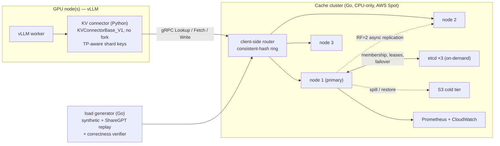
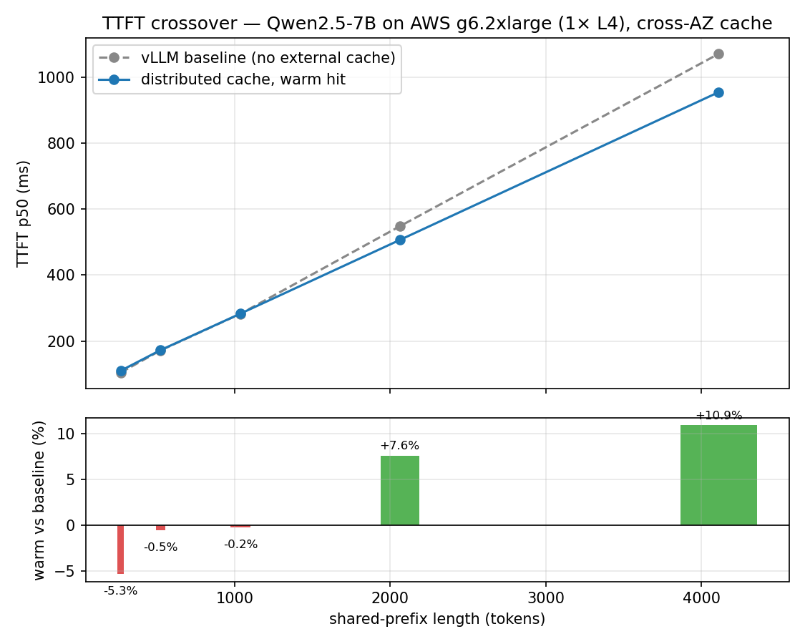
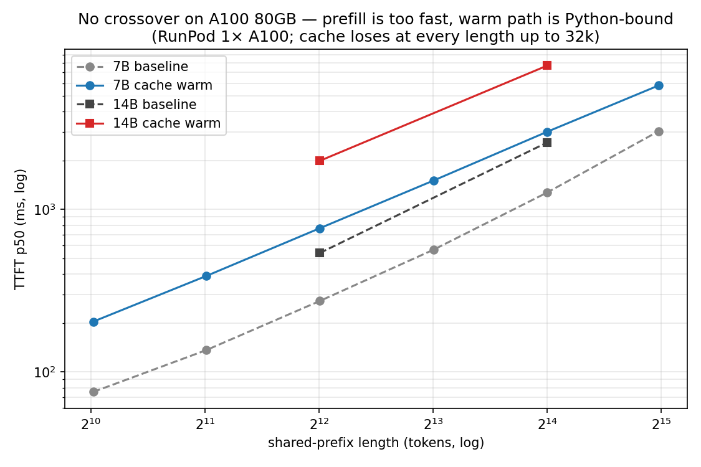
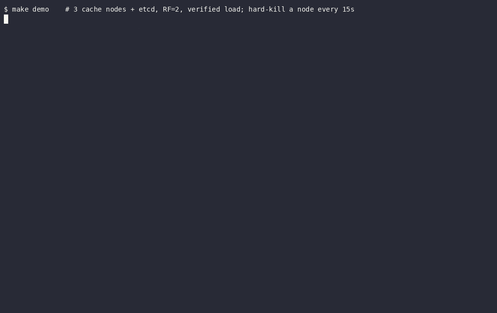

# Distributed KV Cache for LLM Inference

[](https://github.com/haochentSC/Distributed-KV-Cache-for-LLM-Inference/actions/workflows/ci.yml)
[](go.mod)
[](LICENSE)

A distributed cache that shares LLM **attention KV tensors** across a serving cluster, so any GPU
can reuse a prompt prefix another GPU already computed — cutting time-to-first-token (TTFT) on
shared-prefix workloads (system prompts, RAG context, few-shot, agent loops).

Built in **Go** (consistent-hash sharding, RF=2 async replication, etcd-coordinated failover, a
cost-aware + fair eviction policy), integrated with **vLLM** via a custom `KVConnectorBase_V1`
connector (no fork), deployed and benchmarked on **AWS via Terraform** with Spot interruptions as
free chaos testing, and validated up to tensor-parallel 4 / 32B on a GPU cloud.

**Measured, on real hardware:**

| Result | Number | Evidence |
|---|---|---|
| TTFT win at 4k-token shared prefix (1× L4, cross-AZ cache) | **+10.9 %** (116 ms off 1,070 ms) | [`phase45-distributed-gpu.md`](docs/benchmarks/phase45-distributed-gpu.md) |
| ShareGPT replay, live 3-node AWS cluster (6,782 reqs) | **32.7 % hit rate**, p50 62 ms, 0 errors | same |
| Chaos: injected latency, etcd partition, real node kill, Spot drain | **0 correctness violations** | same + [`aws-chaos.sh`](scripts/aws-chaos.sh) |
| Efficiency↔fairness frontier of the eviction policy | tunable: 20 %/1.9 % → ~14 %/~12 % | [`phase5b-eviction.md`](docs/benchmarks/phase5b-eviction.md) |
| TP=4 / Qwen2.5-32B end-to-end keying validation (4× A40) | 512 writes = 128 blocks × 4 ranks, exactly once | [`phase45-gpu-cloud.md`](docs/benchmarks/phase45-gpu-cloud.md) |

> **An educational project, built deliberately.** The goal was depth — distributed systems, Go,
> vLLM internals, cloud/IaC — not shipping fastest. Every significant decision is an ADR
> ([`docs/adr/`](docs/adr/), 35 and counting) and there's a [learning log](docs/learning-log.md).
> Negative results are reported alongside the wins.

## Architecture



- **Sharding:** consistent-hash ring over opaque block keys; keys are content hashes of token
  blocks, so identical prefixes collide on purpose ([ADR 0011](docs/adr/0011-block-wise-key-and-per-block-presence.md),
  [0014](docs/adr/0014-sharding-granularity-prefix-affinity.md)).
- **Replication & failover:** RF=2 async, implicit promotion via ring rotation when etcd leases
  expire; graceful drain handles Spot's 2-minute interruption notice
  ([ADRs 0021–0023](docs/adr/)).
- **Eviction (the differentiator):** GDSF cost-aware value + an elastic per-tenant fairness layer
  behind a swappable policy interface — see below ([ADRs 0029–0030](docs/adr/)).
- **Correctness invariant:** every fetched block carries its content hash; the client re-verifies
  before use, so a wrong byte is a counted *violation*, never silent corruption
  ([ADR 0016](docs/adr/0016-cache-correctness-invariant.md)). Every benchmark and chaos run
  reports this counter. It also caught a real bug — see the war story below.
- **vLLM integration:** a custom `KVConnectorBase_V1` (vLLM 0.22.x) copies paged KV blocks
  GPU↔host↔gRPC, keyed per tensor-parallel rank so TP shards never alias
  ([ADR 0032](docs/adr/0032-tensor-parallel-keys-and-gpu-benchmark-node.md)).

## Results

### TTFT crossover on a real GPU (the headline)



Prefill cost grows super-linearly with prefix length; the cache fetch grows linearly. So the cache
*loses* ~5 % at trivial prefixes (fixed RPC overhead), breaks even around 1k tokens, and wins
**+7.6 % @ 2k / +10.9 % @ 4k tokens** — measured on a g6.2xlarge (1× L4) talking to a t3.small
cluster **in a different AZ**. Details: [`phase45-distributed-gpu.md`](docs/benchmarks/phase45-distributed-gpu.md).

The same window replayed **2,000 ShareGPT conversations** (6,782 requests) against the live
cluster: **32.7 % block hit rate** from genuine multi-turn prefix reuse, 58 req/s, p50/p95/p99 =
62/151/189 ms, traffic balanced 37/31/32 % across shards, 0 violations.

### The honest negative result



On a RunPod **A100 80GB** the crossover never happens within 32k context: the A100 prefills too
fast and the warm path is Python-bound, and a 14B model is *worse* than 7B at the same token count
(KV-bytes grow faster than saved FLOPs). The deficit shrinks monotonically (−171 % → −91 %) but
never crosses zero. When a remote KV cache pays is a function of **GPU prefill speed vs
network/deserialize cost** — not just prefix length. Details:
[`phase45-gpu-cloud.md`](docs/benchmarks/phase45-gpu-cloud.md).

### Chaos engineering: 0 violations through every fault

With the correctness verifier running continuously, the live AWS cluster took: 100 ms injected
egress latency (8,312 reqs), a 30 s etcd partition with lease expiry → ring rotation → rejoin
(11,888 reqs), and a **real node termination** with failover to the surviving 2-node ring
(7,165 reqs). All **0 violations**; the CloudWatch node-loss alarm fires correctly. Spot
interruptions double as free, realistic chaos ([ADR 0006](docs/adr/0006-spot-for-cache-nodes.md),
[0023](docs/adr/0023-graceful-drain-and-spot-interruption.md)).

## The differentiator: a tunable efficiency↔fairness eviction policy


A shared multi-tenant cache has a policy problem: pure value-based eviction (GDSF,
`H = L + freq·cost/size`) maximizes *global* efficiency by starving whoever's blocks are cheapest —
here tenant A ends up at a 1.9 % hit rate while the cache posts its best overall number (20 %).
Static per-tenant quotas fix fairness but tax efficiency even when tenants *aren't* competing
(idle reservations are dead capacity).

This cache's policy makes the floors **elastic and work-conserving**: tenants borrow spare
capacity freely, and under contention a single knob, `fairness_weight w ∈ [0,1]`, scales how
aggressively over-quota tenants' entries are devalued (`H_eff = H/(1+w·overage)`). The measured
frontier above shows the whole tradeoff:

- **`w=0`** is the efficiency corner — best global hit rate, worst-off tenant starves.
- **`w≥0.25`** lands on a fairness plateau (~14 % global / ~12 % min-tenant) — and **the knob
  saturates fast**, the non-obvious finding: a little fairness pressure buys almost all of it.
- The elastic policy **Pareto-dominates static caps** — better on both axes simultaneously.

Where to set it: a latency-SLA tenant wants `w≈0.25` (predictable floor, small efficiency tax);
a batch-throughput cluster wants `w=0`. Run it yourself: `-eviction gdsf-elastic
-fairness-weight 0.25`, sweep via [`scripts/phase5b-sweep.ps1`](scripts/phase5b-sweep.ps1).
Full write-up: [`phase5b-eviction.md`](docs/benchmarks/phase5b-eviction.md).

## War story: the benchmark that caught a silent-corruption bug

The TP=4 validation run (4× A40, Qwen2.5-32B) exposed a real server bug: the store keyed entries
by content hash alone, so the four tensor-parallel ranks — same tokens, *different KV shards* —
clobbered one map slot, last writer wins. The nasty part: the stamped hash still matched, so the
ADR 0016 integrity guard *passed* while serving rank 3's tensor to rank 0. The fix namespaces
store keys by model/shard identity (`SHA-256(model_id ‖ wire_hash)`), re-validated on hardware:
512 writes = 128 blocks × 4 ranks, each exactly once; 9,280 hits, 0 misses, 0 violations.
The whole post-mortem: [ADR 0035](docs/adr/0035-model-namespaced-store-keys.md).

## Prior art, and how this differs

Production systems in this space — worth knowing the landscape:

| System | What it is | How this project differs |
|---|---|---|
| [LMCache](https://github.com/LMCache/LMCache) | The de-facto vLLM KV-cache layer: CPU/disk/remote backends, production connector | Same integration point (`KVConnectorBase_V1`). This project owns the *distributed* layer it usually delegates: consistent hashing, replication, failover, and a multi-tenant eviction policy LMCache doesn't have |
| [NVIDIA Dynamo](https://github.com/ai-dynamo/dynamo) | Datacenter-scale inference framework; KV-aware routing, disaggregated prefill, NIXL transport | A serving *framework* vs this *cache service*; Dynamo optimizes placement/transport at rack scale. No tenant-fairness story in the cache tier |
| [Mooncake](https://github.com/kvcache-ai/Mooncake) | Kimi's production KVCache-centric disaggregated architecture (RDMA, pooled DRAM/SSD) | Mooncake is the existence proof at scale; this is the same architectural bet at learnable scale — plus measured failure-domain behavior (chaos with a correctness invariant) and the fairness knob |

The honest positioning: those are production systems with RDMA-class transports; this is an
educational system on gRPC/TCP. What it adds to the conversation is (1) a **measured
efficiency-vs-fairness frontier** for multi-tenant KV caching, and (2) **chaos-tested correctness
claims** — every benchmark runs with an end-to-end integrity verifier, and the failure modes (Spot
reclaim, partition, node loss) are real, not simulated.

## Demo: kill a node, lose nothing



`make demo` (needs Go + Docker) spins up a local 3-node cluster on etcd, drives verifying load
through it, and hard-kills a random node every 15 seconds. Each kill: the lease expires within
5 s, the ring rotates, the replica serves. The run above: 4 kills, 3 restarts, ~9.5k requests,
**64 % hit rate, 0 errors, 0 violations** — and it exits non-zero if a single byte ever comes
back wrong. (2× speed; replication-retry log spam filtered for readability.)

## Quickstart (local, no GPU)

Requires Go 1.26+. Two terminals:

```bash
# Terminal 1 — one cache shard on :50051
go run ./cmd/cache-server

# Terminal 2 — synthetic shared-prefix traffic; prints hit rate + latency percentiles
go run ./cmd/loadgen
```

Expect a 60–80 % block hit rate with 0 errors once the hot prefix warms. Interesting flags:

```bash
# Cost-aware + fair eviction with the knob, multi-tenant workload, correctness verification
go run ./cmd/cache-server -max-bytes 268435456 -eviction gdsf-elastic -fairness-weight 0.25 \
  -tenant-quota "A=80000000,B=80000000,C=80000000"
go run ./cmd/loadgen -multitenant -verify
```

The full cluster (3 nodes + etcd + replication + failover) runs locally too — `make demo` spins it
up, runs verified traffic, and kills a node mid-run (see Demo below) — and on AWS via
`terraform apply` ([`terraform/`](terraform/), [`docs/05-cloud-deployment-aws.md`](docs/05-cloud-deployment-aws.md)).
Build gates: `go build ./...`, `go test ./... -race`, `gofmt -l .`, `go vet ./...` (CI enforces all four).

## Known limitations

- The CPU tier serves from RAM over gRPC — no RDMA, no GPU-direct. Fine at 7B/L4 scale (it wins);
  outclassed by an A100's prefill (it loses, measured and reported).
- The S3 spill pipeline sheds under burst eviction (drop-over-stall by design: ~40–60 PUT/s vs
  burst rates in the hundreds) — a cold-tier miss is a recompute, never an error.
- Single-writer-per-key consistency model; no cross-region story.

## Repo map

| Path | What's there |
|---|---|
| [`docs/00-project-plan.md`](docs/00-project-plan.md) | Strategy, phases, decision log — the source of truth |
| [`docs/adr/`](docs/adr/) | 35 architecture decision records, ADR 0001 → 0035 |
| [`docs/benchmarks/`](docs/benchmarks/) | Every result above: write-ups + raw JSON + runbooks |
| [`docs/learning-log.md`](docs/learning-log.md) | What was learned, in order |
| [`cmd/`](cmd/) | `cache-server`, `loadgen`, `chaos` binaries |
| [`internal/`](internal/) | `ring`, `cluster`, `cache` (eviction policies), `coord` (etcd), `coldtier`, `server`, `metrics`, `spot` |
| [`connector/`](connector/) | Python vLLM `KVConnectorBase_V1` + tests + benchmark drivers |
| [`proto/`](proto/) / [`gen/`](gen/) | The gRPC contract (one proto → Go + Python clients) |
| [`terraform/`](terraform/) | The whole AWS deployment: VPC, Spot cache nodes, etcd, ECR, S3, CloudWatch, optional GPU node |
| [`scripts/`](scripts/) | Chaos runner, 5b sweep, ShareGPT prep, plot generation |

## License

[MIT](LICENSE).
