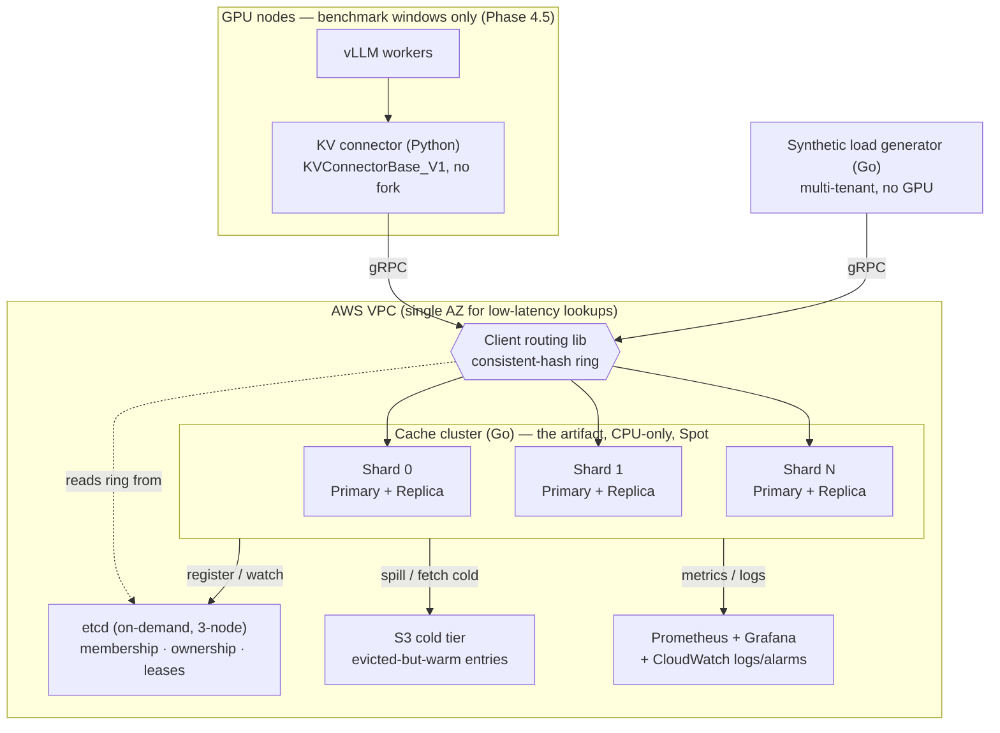
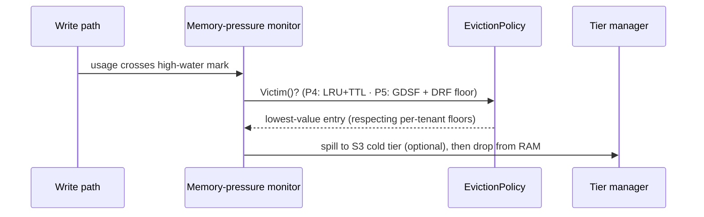

# 01 — Architecture Overview (full-scope target)

> **What this is.** The canonical *target* architecture for the whole system — sharded, replicated,
> multi-tenant, AWS-deployed — at the design level. It is the map for everything Phases 1–5 build
> toward, written now so it can be **reevaluated and modified** before those phases land.
>
> **What this is not.** Not the strategy (that's [`00-project-plan.md`](./00-project-plan.md), the
> source of truth) and not the Phase-1 build detail (that's [`01-architecture.md`](./01-architecture.md),
> the zoom-in on what exists *today*). This doc links to both rather than duplicating them.

## How to read this

Most of the system isn't built yet, so every claim is tagged:

- **`[Decided — ADR NNNN]`** — locked; the rationale lives in the cited ADR under [`adr/`](./adr/).
- **`[PROPOSED — Phase N]`** — a concrete, opinionated design **for HC to ratify or change** in that
  phase's guided session. Each is followed by a **_Pending your design:_** line naming the
  implementation choices deliberately left open (per the working agreement, HC designs + implements
  the distributed core; this doc only proposes the shape).

If a `[PROPOSED]` block looks wrong, that's the point — push back and we revise it before building.

---

## 1. System context (target end-state)



Both clients (the Python vLLM connector and the Go load generator) are generated from **one proto**
and speak the same API `[Decided — ADR 0010]`. The cache cluster and etcd run continuously on cheap
CPU instances; GPUs appear only for the Phase 4.5 end-to-end benchmark. **Today (Phase 1) this whole
picture collapses to a single shard, no ring, no etcd, no S3** — see the [phasing map](#16-phasing-map).

---

## 2. Components & responsibilities

| Component | Lang | Responsibility | First built |
|---|---|---|---|
| vLLM KV connector | Python | `KVConnectorBase_V1` impl; on prefill, look up/fetch prefix KV from the cluster; on miss, write computed KV back. No vLLM fork. | Phase 1 (post-Phase-0) |
| Client / routing lib | Go + Python | Generated gRPC client + shard routing: hash → ring → owning shard; handle unreachable shard as a miss. | Phase 1 (client), Phase 2 (routing) |
| Cache shard | Go | The node: gRPC server, in-memory `Store`, eviction policy, replication, tier manager. | Phase 1 |
| Metadata layer | etcd | Cluster membership, shard ownership ranges, leader leases. Linearizable. | Phase 3 (membership built, Sub-stage A) |
| Cold tier | S3 | Evicted-but-warm entries; benchmark artifacts; Terraform remote state. | Phase 3 |
| Load generator | Go | GPU-free synthetic traffic with configurable payload + prefix-sharing; multi-tenant profiles for the fairness benchmark. | Phase 1 / extended Phase 5 |
| Observability | — | Hit/miss, latency, eviction, replication-lag metrics; OTel traces; CloudWatch logs/alarms. | Phase 4 |

---

## 3. Data model & key design `[Decided — ADR 0010, 0011]`

Detailed in [`01-architecture.md`](./01-architecture.md#key-design-decisions-phase-1); summary here:

- **Key** — block-wise chained hashing: `block_hash[i] = SHA256(block_hash[i-1] || tokenIDs(block i))`,
  fixed seed for block 0, default 16 tokens/block. Shared prefixes ⇒ identical hashes until divergence.
  The hash is **opaque bytes** server-side; the Go server never tokenizes.
- **Lookup** — server reports **per-block presence** (have block `h`? yes/no); the **client** assembles
  the longest contiguous run from index 0. This is why the API survives sharding unchanged: no single
  shard can know the global longest run, and it never needs to.
- **`Entry`** — tensor bytes + metadata: `token_ids` (hit verification), `model_id`, `version`,
  `size_bytes`, timestamps, and the Phase-5 fields `tenant_id` / `recompute_cost` / `access_count`.

---

## 4. gRPC API surface

Defined in [`proto/kvcache/v1/kvcache.proto`](../proto/kvcache/v1/kvcache.proto).

| RPC | Direction | Purpose | Status |
|---|---|---|---|
| `Lookup` | unary | Per-block presence (metadata only, no tensor bytes) | `[Decided]` — exists |
| `Fetch` | server-stream | Stream a block's KV in bounded chunks | `[Decided]` — exists |
| `Write` | client-stream | Header first, then KV chunks | `[Decided]` — exists |
| `Evict` | unary | Remove a block | `[Decided]` — exists |
| `Health` | unary | Liveness/readiness | `[Decided]` — exists |
| `Replicate` | server- or bi-stream | Primary → replica log shipping | `[PROPOSED — P3]` |
| `Handoff` | stream | Transfer owned key-range on rebalance / drain | `[PROPOSED — P2/3]` |

Chunked streaming `[Decided — ADR 0012]` keeps memory bounded and dodges gRPC's 4 MB message cap
(one 16-token block of Llama-3-8B KV ≈ 32 MB). The KV payload itself travels as **opaque framed
bytes** — protobuf carries metadata only, never the tensor — and **serialization overhead is a
Phase 1 exit gate** (confirm `lookup + fetch ≪ recompute` before declaring Phase 1 done)
`[Decided — ADR 0015]`.

_Pending your design (P3):_ whether replication reuses `Write` semantics or gets its own framing;
whether `Handoff` streams entries or just transfers ownership and lets misses re-warm.

---

## 5. Request lifecycles

### 5a. Read path (Phase 1 single-shard; Phase 2 adds routing)

```mermaid
sequenceDiagram
    participant C as Client (connector / loadgen)
    participant R as Routing lib
    participant S as Owning shard
    Note over C: split tokens into blocks; chain-hash to [h0,h1,...]
    C->>R: which shard owns each hash?
    R-->>C: shard per block (Phase 1: always the one node)
    C->>S: Lookup(model, [h0,h1,...])
    S-->>C: per-block presence [hit,hit,miss,...]
    Note over C: longest run from index 0 = reusable prefix
    alt run length > 0
        C->>S: Fetch(model, h_i) (stream)
        S-->>C: KVChunk... last=true
        Note over C: hand KV to vLLM; skip prefill for those tokens
    end
    Note over C: vLLM prefills the missed tokens
    C->>S: Write(header{model,h_j,token_ids,tenant,cost}, chunks...)
    S-->>C: WriteResponse{version, stored}
```

### 5b. Write + replication `[PROPOSED — Phase 3]`

```mermaid
sequenceDiagram
    participant C as Client
    participant P as Primary
    participant Rep as Replica
    C->>P: Write(header, chunks...)
    P->>P: store entry, bump version
    P-->>C: WriteResponse (ack on primary — async RF=2)
    P-)Rep: Replicate(entry @ version)
    Note over Rep: applies asynchronously; replica may lag
```

_Pending your design:_ log format, ordering/versioning across re-deliveries, backpressure when the
replica lags, whether `Fetch` may ever serve from a replica.

### 5c. Failover / promotion `[PROPOSED — Phase 3]`

```mermaid
sequenceDiagram
    participant P as Primary (dying / Spot-reclaimed)
    participant E as etcd
    participant Rep as Replica
    participant Cl as Clients
    Note over P: SIGTERM or ~2-min Spot notice
    P->>P: graceful drain in-flight
    P--xE: lease lapses (or is released)
    E-->>Rep: lease/ownership now claimable
    Rep->>E: acquire lease, claim ownership of range
    E-->>Cl: ring update (watch) — route to new primary
    Note over Rep: serves the range; re-warms from cold tier / on miss
```

_Pending your design:_ lease TTL vs partition-detection window (the split-brain knob), promotion
handshake, reconciliation if the old primary returns.

### 5d. Eviction under memory pressure `[PROPOSED — Phase 4/5]`



---

## 6. Consistency model `[Decided — ADR 0013]`

Two tiers, on purpose:

- **Cache data — eventually consistent.** A stale or missing entry only costs a recompute, which is
  exactly the no-cache baseline. Async replication and lazy cold-tier reads are therefore safe.
- **Metadata — linearizable (etcd).** Stale *ownership* is corrupting: writes land on the wrong shard
  and silently diverge. So shard ownership, membership, and leader leases go through etcd's Raft.

The interview beat: "stale data = free recompute; stale metadata = corruption — so I split the
consistency guarantee along that line."

**Correctness invariant** `[Decided — ADR 0016]`: because misses and staleness are *allowed*,
"correct" can't mean "freshest." The invariant is — the cache may miss or serve a stale version, but
must **never return KV that doesn't match the requested `(block_hash, model_id, token_ids)`**.
Hit-verification on `Fetch` (compare stored `token_ids`/`model_id`, mismatch ⇒ miss) is the guard,
and it's the concrete property the Phase 4 chaos suite asserts against.

---

## 7. Sharding & rebalancing `[Decided — ADR 0014; ring + routing built (ADR 0019)]`

- **Consistent-hash ring** (virtual nodes on the hash space). Each shard owns arcs; adding/removing
  a node moves only `~1/N` of keys instead of reshuffling everything.
- **Decided: key the ring on a prefix root (`block_hash[0]`).** `[Decided — ADR 0014]` Per-block
  hashing gives perfect load balance but **scatters one prefix across many shards** → multi-RPC
  fan-out and max-over-shards latency, which fights the sub-10 ms goal, so it was rejected.
  **Prefix-affinity** (key on a prefix root) co-locates a prompt's blocks on one shard → one-RPC
  lookups, at the cost of **hot shards** for viral prefixes. The recommended end-state is affinity
  **+ hot-prefix replication** (what SGLang/Mooncake do). Ratified 2026-05-25 (ADR 0014 accepted);
  the implemented ring (`internal/ring`) keys on `block_hash[0]`, and Phase 2 *measures* the
  hot-shard effect before adding replication.
- **Phase 2: ring built from a static member list** (ADR 0018); **Phase 3: published in etcd** and
  watched by the routing lib. Client still does per-block presence + run assembly (ADR 0011) within
  the owning shard.
- **Unreachable shard → treat as miss** (log it); never block the read path on a down node.

_Pending your design:_ the granularity decision above (ADR 0014), vnode count, the ring data
structure, and the key-movement protocol on membership change (`Handoff` vs. re-warm on misses).

---

## 8. Replication & fault tolerance `[PROPOSED — Phase 3]`

- **RF=2, primary + 1 replica per shard** `[Decided]`. RF=3 + quorum is overkill for data whose loss
  is just a recompute; RF=2 survives any single node loss at half the replication cost.
- **Async log shipping** — primary acks the write, then streams to the replica (consistent with the
  eventual-data tier in §6).
- **Promotion on lease loss** — replica claims the etcd lease + ownership and starts serving (§5c).
- **Spot interruption → graceful drain** — the ~2-min EC2 Spot notice triggers the same drain path as
  SIGTERM, turning reclamation into a free, realistic failure event.

_Pending your design:_ log format + retention, version reconciliation on old-primary return,
replica-lag backpressure.

---

## 9. Cluster coordination / etcd `[membership built — ADR 0020; ownership/leases PROPOSED — Phase 3]`

**Introduced in Phase 3 (ADR 0018):** Phase 2 built the ring from a static member list; etcd now
provides linearizable membership (Sub-stage A, built), with ownership/leader leases following at
failover (Sub-stages B/C). Membership is **built** per the schema below; the leader/ownership keys
remain the Phase-3 target.

etcd runs **on-demand, 3-node** `[Decided — ADR 0009]` (never Spot — it's the coordination ground
truth, and a real quorum is what makes the split-brain story defensible).

Proposed key layout (illustrative — names/TTLs to be set in-phase):

```
/kvcache/members/<node-id>          -> <addr>            BUILT (ADR 0020): lease-bound; gone = dead
/kvcache/leader/shard-<k>           -> <node-id>         PROPOSED P3: lease-bound primary lock
# no /kvcache/ring/* — the ring is deterministic from the member set (ADR 0018), recomputed per client
```

Lease-based leader election: the primary holds a lease on its shard's leader key; if the lease lapses
(crash/partition/Spot), the replica acquires it and promotes.

_Pending your design:_ the exact schema, lease TTL **vs** partition-detection window (the split-brain
correctness knob), and whether ownership and leadership are one key or two.

---

## 10. Eviction & admission control

The policy lives behind a **swappable `EvictionPolicy` interface** `[Decided — ADR 0007]` — already
scaffolded (`RecordAccess` / `RecordWrite` / `RecordEvict` / `Victim`), so swapping policies never
touches `Store` or the API. Phase 1 uses `NoopPolicy`.

- **Phase 4 baseline `[PROPOSED]`:** LRU + TTL, with memory-pressure detection driving proactive
  eviction. This is the control the differentiator is measured against.
- **Phase 5 differentiator `[PROPOSED]`:** the multi-objective engine from
  [`00-project-plan.md` §3.5](./00-project-plan.md) — **GDSF cost-aware value** (`recompute_cost ×
  reuse / size`, with aging) **+ DRF-style per-tenant fairness floors**, work-conserving, with a
  single `fairness_weight ∈ [0,1]` knob sweeping pure-efficiency ↔ strict-fairness. Needs per-tenant
  accounting in the data model and a multi-tenant load profile.

_Pending your design:_ the GDSF value function details, and (the real work) the **elastic
reclaim-under-contention** algorithm — borrow spare capacity freely, reclaim to a tenant's floor by
evicting the globally lowest-value entry among tenants *above* their floor. Static partitions are
explicitly rejected (they waste idle capacity and kill the tension worth defending).

---

## 11. Storage tiering `[PROPOSED — Phase 3/4]`

`GPU mem (vLLM)` → `CPU RAM (shard)` → `(optional NVMe)` → `S3 cold tier`. The shard's RAM map is the
hot tier; on eviction an entry may be **written to S3** rather than dropped, and a later `Fetch` miss
can **read-through** from S3 before falling back to recompute.

_Pending your design:_ promotion/demotion policy, and how `Fetch` surfaces the variable latency of a
cold read (the lookup contract may need an "available but slow" signal).

---

## 12. Cloud deployment topology (AWS) `[Decided — ADR 0004, 0005, 0006, 0009]`

Whole cluster as **Terraform**; compute split by role:

| Concern | Service | Notes |
|---|---|---|
| Cache nodes | EC2 **Spot** | The artifact; CPU-only; sized for working-set RAM. Spot loss = free chaos. |
| etcd | EC2 **on-demand ×3** | Coordination ground truth; never Spot. |
| GPU workers | EC2 GPU, **benchmark only** | Same VPC/AZ; up for hours (Phase 4.5), then `destroy`. |
| Networking | VPC, subnets, SGs, placement group | Single AZ for sub-10 ms lookups. |
| Identity | IAM roles + instance profiles | **No static credentials anywhere.** |
| Object storage | S3 (+ DynamoDB lock) | Cold tier, artifacts, **Terraform remote state**. |
| Registry | ECR | Cache server image. |
| Observability | CloudWatch | Logs + alarms alongside Prometheus/Grafana. |

EC2 (not EKS) for v1 `[Decided — ADR 0005]`: a managed k8s control plane self-heals and would fight
the Phase-4 chaos harness, contaminating recovery measurements. EKS is a *post-v1* stretch.

---

## 13. Observability `[PROPOSED — Phase 4]`

Metrics (per plan §3): hit rate (overall / per-shard / per-prefix-length), Lookup & Fetch latency
p50/p95/p99, eviction rate + reason, end-to-end TTFT (cache vs no-cache), per-shard memory, replication
lag. **OpenTelemetry** traces span connector → routing → shard → tier. CloudWatch carries logs + a few
alarms so the story covers both open-source and cloud-native observability.

---

## 14. Cross-cutting concerns

- **Backpressure / flow control** — multi-MB streamed writes need bounded in-flight bytes per stream
  and a server-side admission check that **rejects fast** (`RESOURCE_EXHAUSTED`) above a high-water
  mark rather than accepting and OOMing — a rejected write just recomputes (safe per ADR 0016).
  `[PROPOSED — ADR 0017, P1/P4]`
- **Security** — IAM roles + instance profiles (no static creds); opaque keys mean the cache never
  holds raw prompt text; SGs restrict node-to-node gRPC. `[Decided]`
- **Versioning** — proto evolves additively (new RPCs/fields, never renumber); each `Entry` carries a
  `version` for replication/reconciliation. `[Decided/PROPOSED]`

### Failure & degradation modes

| Failure | Detection | Response | Phase |
|---|---|---|---|
| Cache miss (cold/evicted) | per-block presence = no | vLLM recomputes (baseline) | P1 |
| Shard unreachable | RPC error / health | route as miss, log | P2 |
| Primary crash / Spot reclaim | etcd lease lapse | replica promotes (§5c) | P3 |
| Network partition | lease + heartbeat | lease TTL < detection window prevents dual-primary | P3 |
| Memory pressure | high-water mark | proactive eviction / spill to S3 | P4 |
| Replica lag | replication-lag metric | backpressure / alarm | P3/P4 |

---

## 15. Phasing map

What of this architecture exists when. **Today = Phase 1.**

| Element | P1 | P2 | P3 | P4 | P4.5 | P5 |
|---|:--:|:--:|:--:|:--:|:--:|:--:|
| Single shard: Store + gRPC + chunked transport | ✅ | ✅ | ✅ | ✅ | ✅ | ✅ |
| Block-hash key + per-block presence | ✅ | ✅ | ✅ | ✅ | ✅ | ✅ |
| vLLM connector (no fork) | ◐* | ✅ | ✅ | ✅ | ✅ | ✅ |
| Consistent-hash ring + routing | | ✅ | ✅ | ✅ | ✅ | ✅ |
| etcd (membership/ownership/leases) | | | ✅ | ✅ | ✅ | ✅ |
| Replication RF=2 + failover | | | ✅ | ✅ | ✅ | ✅ |
| S3 cold tier | | | ✅ | ✅ | ✅ | ✅ |
| LRU+TTL eviction + observability + chaos | | | | ✅ | ✅ | ✅ |
| End-to-end GPU TTFT number | | | | | ✅ | ✅ |
| Multi-objective GDSF+DRF policy + knob | | | | | | ✅ |

*◐ connector slips after Phase 0 (local vLLM + GPU) is done. Phase 4 is the **core-ships gate**;
Phase 5 is gated behind it. **Phase 2 status (2026-05-27): complete** — the consistent-hash ring
(`internal/ring`, prefix-affinity per ADR 0014) and the client-side routing layer (`internal/cluster`,
ADR 0019) are built; a live 3-shard run reports the per-shard distribution (hot shard ~87% at
`prefix-share=0.8`). **etcd moved to Phase 3** (ADR 0018) — Phase 2 uses static ring membership. Full roadmap: [`02-roadmap-and-workflow.md`](./02-roadmap-and-workflow.md)
and [`00-project-plan.md` §4](./00-project-plan.md).

---

## 16. Open design questions (the reevaluate-and-modify worksheet)

Everything deliberately left for HC's guided sessions, by phase:

- **Phase 2 — sharding:** ~~granularity (ADR 0014)~~ **decided: prefix-affinity, key on
  `block_hash[0]` (ADR 0014 accepted)**; vnode count (**128** in the current ring); ring data
  structure (**sorted vpoint slice + binary search — built**); key-movement on membership change
  (`Handoff` vs re-warm — still open).
- **Phase 3 — etcd** (deferred from Phase 2, ADR 0018)**:** exact key schema; ownership and
  leadership as one key or two.
- **Phase 3 — replication/failover:** replication log format + retention; lease TTL vs
  partition-detection window; old-primary reconciliation; replica-lag backpressure; may `Fetch`
  serve from a replica?
- **Phase 3/4 — tiering:** promotion/demotion policy; how `Fetch` signals a slow cold read.
- **Phase 4 — eviction baseline:** LRU vs LRU+TTL specifics; memory high/low-water marks.
- **Phase 5 — differentiator:** GDSF value function; the elastic reclaim-under-contention algorithm;
  `fairness_weight` semantics.
- **Cross-cutting:** write admission / backpressure marks + budgets (ADR 0017); proto evolution
  conventions.

Each becomes an **ADR** when decided in its phase (the working-agreement *Capture* step).

## Deep dives (load-on-demand)

`distributed-systems-in-go`, `vllm-integration`, `cloud-deploy-aws`, `eviction-policy-gdsf-drf`
skills, indexed by [`03`](./03-distributed-systems-in-go.md) / [`04`](./04-kv-cache-and-vllm.md) /
[`05`](./05-cloud-deployment-aws.md).
