# 01 — Architecture (Phase 1 detail)

> **Living system-design record — the Phase-1 zoom-in.** The full-scope target architecture (all
> phases) lives in [`01-architecture-overview.md`](./01-architecture-overview.md); this doc is the
> detailed slice of what exists *today*. Later-phase internals are added here as we build them.
> Complements (doesn't duplicate) [`00-project-plan.md`](./00-project-plan.md). Decisions are
> recorded as ADRs in [`adr/`](./adr/).

## System overview

```mermaid
flowchart TD
    subgraph GPU["GPU node (benchmark windows only)"]
        vllm["vLLM worker"] --> conn["KV connector (Python)<br/>KVConnectorBase_V1, no fork"]
    end
    conn -- "gRPC: Lookup/Fetch/Write" --> cache
    lg["Synthetic load generator (Go)<br/>no GPU needed"] -- "gRPC" --> cache
    subgraph CPU["CPU nodes (the artifact)"]
        cache["Cache shard(s) (Go)<br/>striped map + eviction policy"]
        cache -. "Phase 3: shard ownership" .-> etcd["etcd (Phase 3)"]
    end
    cache -. "Phase 4 metrics" .-> obs["Prometheus/Grafana + CloudWatch"]
```



Both clients (Python connector, Go load generator) are generated from one proto and speak the
same API. In Phase 1 there is a single shard and no etcd; the load generator exercises everything
without a GPU.

## Request lifecycle

```mermaid
sequenceDiagram
    participant C as Client (connector / loadgen)
    participant S as Cache shard
    Note over C: split tokens into blocks; chain-hash → [h0,h1,...]
    C->>S: Lookup(model, [h0,h1,...])
    S-->>C: per-block presence [hit,hit,miss,...]
    Note over C: longest run from index 0 = shared prefix
    alt run length > 0 (hit)
        C->>S: Fetch(model, h_i)  (stream chunks)
        S-->>C: KVChunk... (last=true)
        Note over C: hand KV to vLLM; skip prefill for those tokens
    end
    Note over C: vLLM prefills the remaining (missed) tokens
    C->>S: Write(header{model,h_j,token_ids,tenant,cost}, chunks...)
    S-->>C: WriteResponse{version, stored}
```

## Key design decisions (Phase 1)

| Decision | Choice | ADR |
|---|---|---|
| Cache key & lookup | Block-wise chained hashing; **exact-key (1 block) first**, grows to longest-prefix. Server reports **per-block presence**; client assembles the longest run | [0011](./adr/0011-block-wise-key-and-per-block-presence.md) |
| Tensor transport | **Chunked streaming** (`Fetch` server-streams, `Write` client-streams) — bounded memory, dodges gRPC's 4 MB message cap | [0012](./adr/0012-chunked-streaming-transport.md) |
| Tensor payload | **Opaque framed bytes** (protobuf for metadata only); `lookup + fetch ≪ recompute` is a **Phase 1 exit gate** | [0015](./adr/0015-raw-bytes-kv-payload-and-serialization-gate.md) |
| Consistency boundary | Cache data **eventually consistent**; metadata (Phase 3, etcd) **linearizable** | [0013](./adr/0013-consistency-boundary.md) |
| Key is opaque server-side | `prefix_hash`/`block_hash` are opaque bytes; tokenization stays client-side | [0010](./adr/0010-opaque-key-two-clients.md) |

**Why per-block presence (not server-side longest-match):** blocks shard independently in Phase 2,
so a single shard can't know the global longest run anyway. Keeping the server "do I have block
`h`? yes/no" and letting the **client** assemble the longest contiguous run makes the exact same
API work unchanged once blocks live on different shards. Phase 1 just sends a 1-element list.

**Block hashing:** `block_hash[i] = SHA256( block_hash[i-1] || tokenIDs(block i) )`, fixed seed for
block 0, fixed block size (default **16 tokens**). Shared prefixes ⇒ identical hashes until
divergence. Exact formula is confirmed against vLLM source when the connector is built (Phase 1,
post-Phase-0). The Go server treats the hash as opaque — it never tokenizes.

## gRPC surface

Defined in [`proto/kvcache/v1/kvcache.proto`](../proto/kvcache/v1/kvcache.proto):

- `Lookup(model, repeated block_hashes) → repeated BlockPresence` — metadata only, no tensor bytes.
- `Fetch(model, block_hash, version) → stream KVChunk` — bounded chunks.
- `Write(stream WriteChunk{header|chunk}) → WriteResponse` — header first, then data frames.
  Header carries `token_ids` (hit verification), `tenant_id` + `recompute_cost` (Phase 5).
- `Evict`, `Health`.

## Single-shard internals (Go)

- **`Store` = striped mutex map** (an array of shards, each `RWMutex` + `map[BlockHash]*Entry`) —
  not one global lock, not `sync.Map` (write-heavy, large values, composite check-then-act). See
  the `distributed-systems-in-go` skill `pitfalls.md`.
- **`Entry`** holds tensor bytes + metadata (`token_ids`, size, timestamps, version, and the
  Phase 5 fields `tenant_id`/`recompute_cost`/`access_count`).
- **`EvictionPolicy` interface** is the swappable seam mandated by the plan: Phase 1 = `NoopPolicy`;
  Phase 4 = LRU+TTL; Phase 5 = GDSF + fairness — no change to `Store` or the API.
- **Hit verification (the correctness-invariant guard, [ADR 0016](./adr/0016-cache-correctness-invariant.md)):**
  on `Fetch`, compare stored `token_ids`/`model_id` and treat a mismatch as a miss. This upholds the
  invariant *never serve KV that mismatches the requested `(block_hash, model_id, token_ids)`* —
  misses and staleness are allowed, wrong-but-plausible KV is not. Cheap guard against hash collision
  or tokenizer/model mismatch.

## Deferred to later phases (seams placed, internals not designed yet)

Consistent-hashing ring (Phase 2 — **built**, `internal/ring`) + shard routing (Phase 2, in
progress), replication/failover + etcd leases (Phase 3 — etcd deferred from Phase 2 per ADR 0018),
real eviction + observability + chaos (Phase 4), the multi-objective policy (Phase 5). The API,
opaque key, per-block presence, and eviction interface are positioned so these slot in without
rework.

## Deep dives (load-on-demand)

`distributed-systems-in-go`, `vllm-integration`, `cloud-deploy-aws`, `eviction-policy-gdsf-drf`
skills, indexed by [`03`](./03-distributed-systems-in-go.md)/[`04`](./04-kv-cache-and-vllm.md)/[`05`](./05-cloud-deployment-aws.md).
