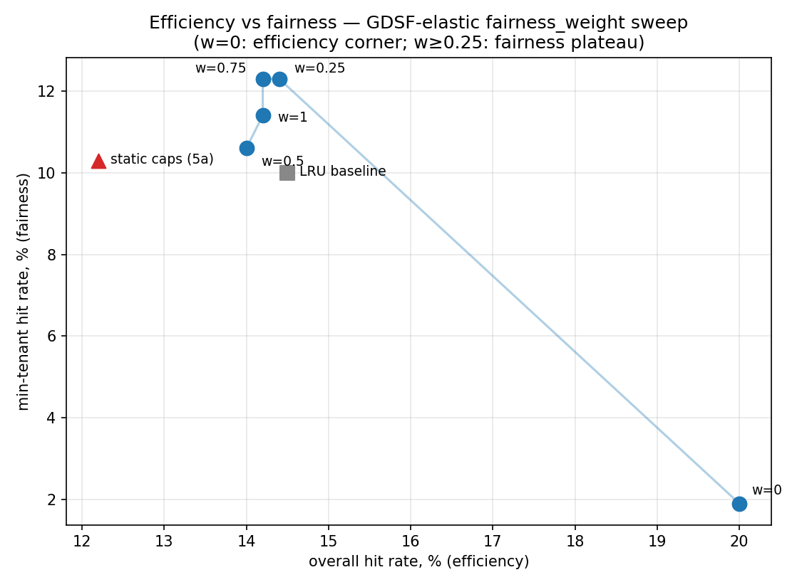

# Phase 5b — Work-conserving floors + the `fairness_weight` knob (the Pareto curve)

Status: **complete (local).** Sweeps the efficiency-vs-fairness knob to draw the Pareto frontier
between pure cost-aware GDSF (efficiency) and max-min fairness (plan §3.5, ADR 0007, ADR 0030).
Builds directly on the 5a tension (`phase5a-eviction.md`). No GPU / no AWS.

## What changed from 5a

5a quotas were **hard caps** — a tenant over quota was reclaimed *even with free global capacity*
(`OverQuota()` was an independent eviction trigger). That is not work-conserving: it can leave the
cache under-full. 5b turns quotas into **elastic floors**:

- **Work-conserving.** `gdsf-elastic`'s `OverQuota()` always returns `false`, so eviction is
  watermark-only — a tenant borrows idle capacity freely and is only squeezed under genuine global
  pressure.
- **Fairness moves into victim selection**, governed by one knob `w = fairness-weight ∈ [0,1]`:

  ```
  H_eff(block) = H(block) / (1 + w · overage_t),   overage_t = max(0, bytes_t/floor_t − 1)
  ```

  A tenant at/below its floor keeps its true GDSF priority (protected); a tenant above its floor is
  discounted toward 0 (evicted first). `w=0` ⇒ no discount ⇒ pure global GDSF; larger `w` ⇒ stronger
  max-min bias. The discount is a per-tenant scalar, so it preserves each tenant's intra-heap order —
  victim selection stays an O(#tenants) root-peek.

## Environment

Identical workload to 5a (`phase5a-eviction.md`): single `cache-server`, `-max-bytes 16777216`
(16 MiB ≈ 256 × 64 KiB), default watermarks; `loadgen -multitenant` (tenants A cheap/frequent,
B expensive/rare, C bursty) whose hot-prefix-pool union (~29 MiB) oversubscribes the cache.
Per-tenant budget `A=6 MiB, B=7 MiB, C=3 MiB` (Σ = 16 MiB) — used as **floors** here.

`loadgen -multitenant -payload-bytes 65536 -concurrency 8 -requests 800 -tail-blocks 2`, **averaged
over seeds {7, 11, 23}** (concurrency-8 eviction ordering is nondeterministic; averaging removes the
run-to-run jitter that made a single seed's mid-curve non-monotonic). Reproduce:
`scripts/phase5b-sweep.ps1`.

## Results (block hit rate, mean of 3 seeds; 2026-06-07)



(Regenerate: `make plots`; data: [`phase5b-frontier.csv`](phase5b-frontier.csv).)

| Config                    | Overall (efficiency) | A (cheap) | B (expensive) | C (bursty) | **min-tenant (fairness)** |
|---------------------------|:--:|:--:|:--:|:--:|:--:|
| LRU baseline              | 14.5% | 14.6% | 14.7% | 10.0% | 10.0% |
| gdsf static-cap (5a)      | 12.2% | 16.8% | 10.3% | 12.2% | 10.3% |
| **gdsf-elastic w=0**      | **20.0%** | 1.9% | 28.7% | 3.2% | 1.9% |
| gdsf-elastic w=0.25       | 14.4% | 16.8% | 13.6% | 12.3% | **12.3%** |
| gdsf-elastic w=0.5        | 14.0% | 17.8% | 12.7% | 10.6% | 10.6% |
| gdsf-elastic w=0.75       | 14.2% | 17.9% | 12.7% | 12.3% | 12.3% |
| gdsf-elastic w=1          | 14.2% | 18.2% | 12.8% | 11.4% | 11.4% |

0 correctness violations in every run (ADR 0016 holds under elastic eviction).

## Reading — the Pareto frontier

- **w=0 is the efficiency corner and reproduces pure GDSF.** No discount ⇒ globally greedy: highest
  overall (20.0%), but B hoards (28.7%) and the cheap tenant collapses (A 1.9%, min 1.9%). This is
  the no-fairness endpoint the knob departs from (≈ 5a's pure-GDSF 21.5%).
- **Any w>0 trades ~6 pts of overall for a 6× fairness gain.** Turning the knob to 0.25 drops
  overall 20.0% → 14.4% but lifts the min tenant 1.9% → 12.3% and pulls B down from hoarding
  (28.7% → 13.6%) while the cheap tenant recovers (1.9% → 16.8%). That is the frontier: the operator
  buys fairness with efficiency, continuously.
- **The knob saturates — a real design finding, not noise.** The whole move happens between w=0 and
  w=0.25; w∈[0.25, 1] is a plateau (~14% overall, min ~11–12%). The multiplicative discount is very
  sensitive near 0: once it is large enough to reorder victims toward over-floor tenants, more `w`
  barely changes the ordering. So this knob is effectively *off (w=0)* vs *on (w≥~0.25)* with fine
  control only in a narrow band. A more linearly-responsive blend (e.g. additive rank mixing) is a
  candidate refinement — noted, not built.
- **Work-conserving beats static caps on BOTH axes — the headline.** Elastic w=0.25 (14.4% overall /
  12.3% min) **Pareto-dominates** the 5a static-cap point (12.2% / 10.3%): strictly more efficient
  *and* more fair. Not leaving capacity idle (no hard cap) is a free lunch — the floor delivers the
  same protection at higher utilisation. It also beats LRU on fairness (12.3% vs 10.0% min) at
  comparable overall.

## Caveats / honesty

- **Do not cross-compare point-for-point with the 5a table.** This run is a 3-seed mean; the 5a doc
  is single-seed (7). Each table is internally consistent (same harness, same seeds across rows);
  absolute levels differ by averaging + machine state. The *relative* ordering is the result.
- The frontier is coarse (5 weights) and the interesting region is `w ∈ [0, 0.25]`; a finer sweep
  there would resolve the knee. Left coarse deliberately — the qualitative frontier is the point.
- Single shard, local, CPU-only. Re-running across the 3-node AWS cluster is batched with the
  deferred Phase-4 AWS verification window.
- Floors are sized Σ = maxBytes here. With Σ < maxBytes there is headroom no floor claims, which the
  work-conserving policy hands to whoever is hottest — a knob worth exploring but out of 5b scope.
